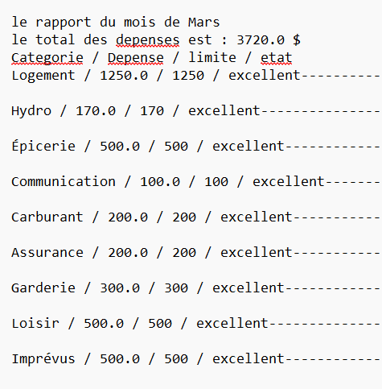

## Utilisateur
# Fonctionnalité
- Lecture de fichier CSV.
- Lecture de fichier json contenant les limites de budget.
- Analyse automatique des dépenses par catégorie.
- Générer un rapport texte.
- 
# Limitations
- Les catégories doivent exister dans le fichier JSON car une catégorie absente sera marquée comme inconnue
- Le programme ne vérifie pas la cohérence des données entre CSV et JSON
- Le rapport généré est uniquement en format texte (.txt)
- le programme est sensible à la casse
- le programme ne gère pas les budgets mensuels multiples
# Installation
- Installation python
- Télécharger les fichiers
- Projet_principal.py
- Projet_lecture.py
- Projet_rapport.py
# FAQ
**Le programme ne se lance pas que faire?**
  
- Vérifie que Python 3.10+ est bien installé.
- Assure-toi d'exécuter le programme dépuis le bon dossier.
- Vérifie que les fichiers liste_depenses.csv et budget.josn sont bien dans le dossier (data). 

**Le programme dit que le fichier CSV ou JSON est introuvable**

- Vérifie l'orthographe exacte des noms de fichiers
- Vérifie que la structure des dossiers est respectée

**Le programme affiche "montant invalide dans le CSV**

- Vérifie qu'il n'y a pas de texte, symbole ou cellule vide dans les colonnes
- Assure-toi que les montants utilisent un point (.) comme séparateur décimal.

**Le rapport généré est vide ou incomplet**

- vérifie que le CSV contient bien des lignes après les en-têtes.
- Vérifie que les catégories du CSV correspondent à celle du JSON
- Assure toi que la fonction *analyse()* reçoit bien les données

**Le programme plante sans message claire.**

- verifie les indentations dans le fichier python
- Vérifie également le chemin de fichier 

**Puis-je ajoter de nouvelles catégories?**

Oui
- Ajoute la catégorie dans le CSV.
- Ajoute la limite correspondante dans le JSON et le programme les analysera automatiquement

**Comment réinitialiser dans le projet si tout est cassé?**
- Supprime le fichier *rapport.txt*
- Remets les fichiers CSV et JSON d'origine.
- Relance *Projet_principal.py*

# Communauté
- etudiant du Cegep
  
# Table des matières
###

# Utilisation
- Executer seulement le fichier *Projet_principal.py*
- le programme lit, analyse et génère un rapport dans le dossier *output/rapport.txt*

# Resumé du projet
Le programme automatise la gestion d'un budget mensuel.
Le programme lit les dépenses par catégorie,
compare chaque montant à la limite définie dans le budget JSON puis indique si la catégorie est excellente, dépassée ou inconnue. Le programme calcul le total des dépenses et écrit un rapport complet.

# Example

le rapport du mois de Mars
le total des depenses est : 3720.0 $
Categorie / Depense / limite / etat
Logement / 1250.0 / 1250 / excellent---------------
Hydro / 170.0 / 170 / excellent--------------------
Épicerie / 500.0 / 500 /excellent------------------
Communication / 100.0 / 100 / excellent------------

# Sreenshot

## Programmeur

# Créer son environnement de developpement
- Installer Python
- Utiliser VS code
- Activer l'extension Python
- Organiser les fichiers dans une structure claire (data/, output/, modules Python)

# Lien vers ressource 

# Comment régler des problèmes
- Si le programme plante: Vérifier les indentations
- Si les choix ne fonctionnent pas: Verifier le "Return"
- Si la question ne s'affiche pas: Vérifier l'appel à "demander_choix".

# Versionnage
- une seule version complète

# Test
- Tester chaque catégorie individuellement
- Tester un CSV vide
- tester un JSON sans limite pour une catégorie

# Problèmes connus
- l'utilisateur peut saisir un texte non numérique
- le programme ne gère pas encore les sous-catégorie

# Calendrier de fonctionnalité à venir
- faire des interfaces graphiques
- Ajout des couleurs dans le terminal
- Export du rapport en PDF 

# Chose à venir
- Ajouter plus de scénario

# Dépendance
- le programme n'a aucune dépendance externe
- le programme utilise uniquement la bibliothèque Python standard.

# Requis
- Python 3.10 et plus
- Terminal fonctionnel
- Respecter la structure de fichier

## Légal

# Licence
- Projet éducatif libre d'utilisation dans un cadre scolaire

# Contribution
- les contributions sont acceptées:
- Ajout de cqtégories
- Amélioration du code
- Correction de bugs
- Optimisation de la structure

# Remerciement
- Enseignant du cour de programmation 1 au Cegep de Sherbrooke
- Mes collegues du groupe 21181
- Joseph_Boka developpeur du projet
